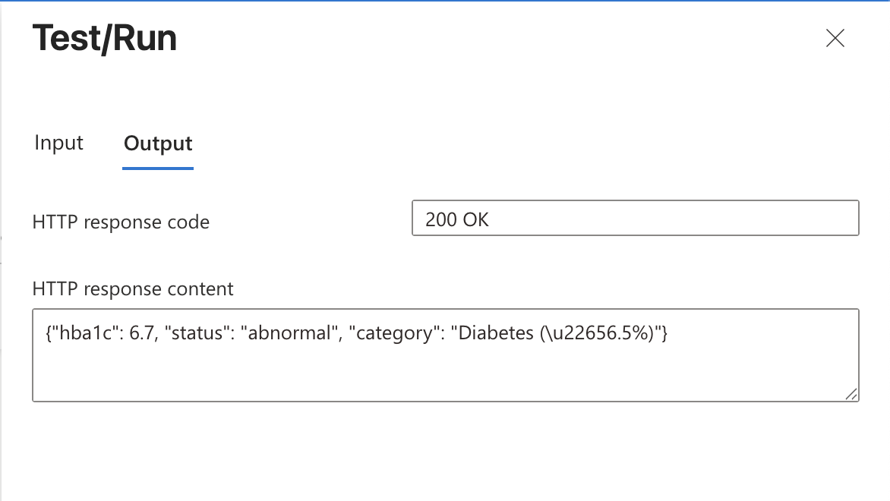
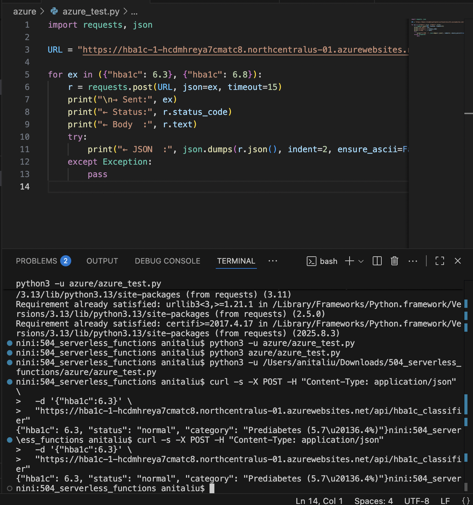
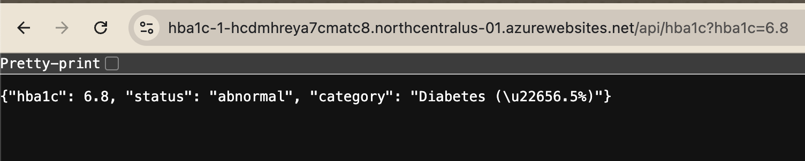
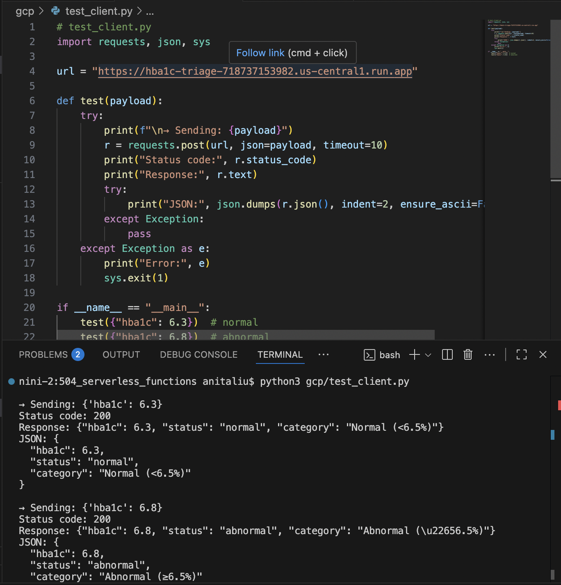
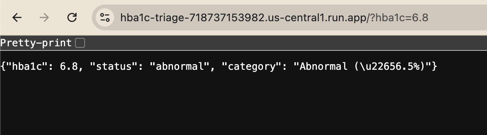

# Multi‑Cloud Serverless Function
The purpose of this assignment is to implement the same HTTP serverless function in two clouds: Google Cloud Platform (GCP) and Microsoft Azure. The function accepts JSON input values describing HbA1c levels, applies a simple binary classifier to determine whether the value is normal or abnormal, and returns the result as a structured JSON response.

## Lab Rules (HbA1c)
- Rule: Normal if hba1c < 6.5; otherwise Abnormal.

- Plain English: If HbA1c is below 6.5%, the status is normal; if 6.5% or higher, it’s abnormal.

- Clinical Citation:
    - American Diabetes Association. Standards of Medical Care in Diabetes – 2025. Diabetes Care. 2025;48(Suppl. 1):S1–S157. https://doi.org/10.2337/dc25-S001
    - Centers for Disease Control and Prevention (CDC): https://www.cdc.gov/diabetes/managing/managing-blood-sugar/a1c.html

# Azure 
- Subscription: Azure for Students
- Resource Group: 504
- Function name: hba1c-1
- OS: Linux
- Runtime Slack: Python 3.12
- Region: north central us
- Leave everything else.
- Endpoint link: https://hba1c-1-hcdmhreya7cmatc8.northcentralus-01.azurewebsites.net/api/hba1c_classifier
- [Tutorial](https://drive.google.com/file/d/16sZkpAfjILc8fJtlTnA7zyGZHuy4BCxE/view?usp=sharing)

## Steps
- Logged into Azure and made a resource group and named it 504.
- Used the search bar to locate ```Function App``` and selected create, and then consumption. Made sure all of the followering were selected. 
    Subscription: Azure for Students 
    Resource Group: 504 
    Function name: hba1c-1 
    OS: Linux 
    Runtime Slack: Python 3.12 
    Region: north central us
- Leave everything else.
- After the deployment is complete, select "Go to resrouce" and then select create function and HTTP Trigger.
- Name the function, in this case I named it "hba1c_classifier"
- I added my code in ```__init___.py``` and click save.

## Testing
- Click Test/Run in order to open up another screen.
- I inputted query parameters with hba1c being the name and the value of 6.7 just to test if everything worked. 



- You should see the 200 OK and a response code that represents the value and status.

### POST Request
I ran the code that I placed in the ```__init___.py``` file and used python to run it.



### GET Request
I was able to copy the url from the ```Get Function URL``` tab in Azure. I then was able to use ```?hba1c=6.7``` or any other value to test and see if everything was executed successfully.



# Google Cloud
- Named the file hba1c-triage
- Chose us-central1 for the region
- Selected python 3.13
- Allowed for public access
- Networking, select all
- Endpoint link: https://hba1c-triage-718737153982.us-central1.run.app
- [Tutorial](https://drive.google.com/file/d/1gR97tq3UK3Acb5N-K6Qs_y_ht9WCuXvi/view?usp=sharing)

## Steps
1. Log into Google Cloud
2. Searched for Cloud run and then selected "create a service"
3. I then selected inline editor to create a function
4. Named the service hba1c-triage and chose the region "us-central1" and selected Python 3.13 for runtime. I selected Allow public access and made billing request based. I then made the maximum number of instances to 1 and changed ingress to All.
5. Click on "create"
6. Changed the key of the entry point to the "main.py" code in the gcp folder.
7. Renamed as hba1c-triage and clicked save and deploy to update the new code.
8. I was able to copy the URL and use it to do a series of tests. 

## Testing

### POST Request
I ran the deployed GCP Cloud Function endpoint directly from VS Code using Python.



I made a new file labeled ```test_client.py``` where I then ran this using the command ```python3 gcp/test_client.py```

### GET Request
Using the URL of the end point link, I pasted it into the browser and typed in ```?hba1c=6.8``` and it generated a response for me



## Comparison
Google Cloud Platform (GCP) was straightforward to work with, the deployment only required a single gcloud functions deploy command and the endpoint was immediately available. Testing through both the console and Python requests was seamless, and logs were easily viewable through Cloud Logging. In contrast, Microsoft Azure was much harder to work with. The platform required more setup steps (creating a resource group, storage account, and function app), and I ran into several errors during deployment and testing. The routing and authentication settings were confusing, and syncing triggers or restarting the app was often necessary to make updates visible. Overall, Azure felt more complex and error-prone, while GCP offered a smoother and faster workflow.
